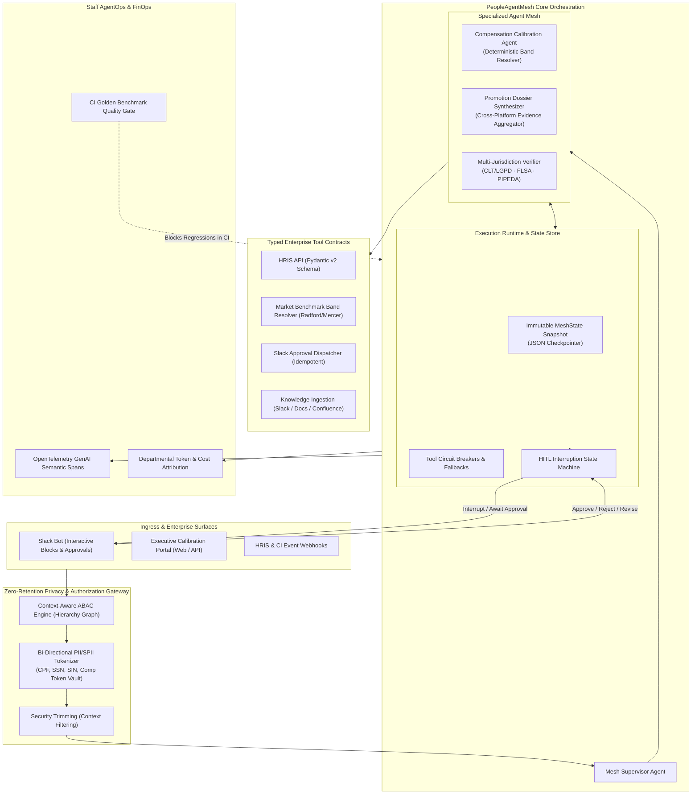

# PeopleAgentMesh: Enterprise Multi-Agent Orchestration & Governance Platform

[](https://github.com/pedrogriff/people-agent-mesh/actions)
[](https://www.python.org/downloads/)
[](https://mypy-lang.org/)
[](https://github.com/astral-sh/ruff)
[](docs/ADR-002-zero-retention-privacy-gateway.md)
[](src/people_agent_mesh/telemetry/tracer.py)
[](tests/)
[](https://playgriff.me/people-agent-mesh/)

> **Staff Software Engineer Showcase System**: A production-grade multi-agent orchestration, human-in-the-loop (HITL) governance, and evaluation platform designed specifically for sensitive **People Operations, Compensation Planning, and Talent Calibration** across **Brazil (🇧🇷), the United States (🇺🇸), and Canada (🇨🇦)**.

---

## 💡 Executive Summary

Modern enterprise AI in high-stakes HR cannot be a toy prompt wrapper or an unconstrained autonomous loop. It must satisfy five non-negotiable engineering mandates:
1. **Zero-Retention Perimeter Defense**: Bi-directional tokenization for sensitive PII/SPII (Brazilian CPF, US SSN, Canadian SIN, compensation figures) guaranteeing zero sensitive identifier leakage across model boundaries.
2. **Deterministic State Graph Orchestration**: Checkpointed state machine supporting asynchronous pause/resume human-in-the-loop (HITL) approvals that can span hours or days without active socket overhead.
3. **Multi-Jurisdiction Labor Compliance**: Statutory verification enforcing Brazil's CLT (Article 468 wage irreducibility, parental protections), US FLSA exempt salary baselines, and Canadian pay transparency standards.
4. **Resilient Tool Contracts**: Pydantic v2 typed RPC contracts protected by sliding-window circuit breakers, idempotency keys, and deterministic rule-engine fallbacks.
5. **Staff Quality Bar & CI Evals**: Automated evaluation suite running golden benchmarks in GitHub Actions, gating pull requests on faithfulness (>95%), compliance adherence (100%), and p95 latency.

---

## 🏛️ System Architecture



---

## 🚀 Key Engineering Pillars

### 1. Stateful Multi-Agent Orchestration & HITL Checkpointing
- **Supervisor-Specialist Pattern**: Decomposes complex reviews into parallel specialist workflows (`CompensationAgent`, `PromotionAgent`).
- **Interruptible State Engine**: When a proposed action exceeds organizational risk thresholds (e.g. merit increase $\ge 10\%$, out-of-band compa-ratio $>1.15$, or promotion with readiness variance), the engine:
  1. Halts execution and transitions to `AWAITING_HUMAN_APPROVAL`.
  2. Dispatches an interactive Slack block kit approval with a unique callback token.
  3. Serializes the complete execution state (`to_snapshot()`) to storage.
  4. Resumes deterministically upon human sign-off without re-running prior steps.

### 2. Zero-Retention Privacy Gateway (LGPD · PIPEDA · US)
- **Surrogate Tokenization**: Intercepts raw text and replaces sensitive identifiers with cryptographic surrogates (`[TOKEN_CPF_F788964B]`, `[TOKEN_COMP_C4F08C62]`).
- **Hard Assert Barrier**: `assert_zero_pii_leakage()` runs regex verification prior to any model call, failing fast if unmasked identifiers are detected.
- **Cryptographic Shredding**: Supports LGPD Article 18 / right-to-be-forgotten by cryptographically purging the in-memory vault, permanently anonymizing historical traces.

### 3. Context-Aware ABAC & Security Trimming
- **Reporting Hierarchy Graph**: Evaluates organizational reporting trees to ensure managers can only view or calibrate direct/transitive reports.
- **Context Trimming**: Filters ingested documents (Slack kudos, 1-on-1 notes) *before* prompt injection, preventing unauthorized cross-team data exposure.

### 4. Resilient Tool Contracts & Circuit Breakers
- **Typed Schemas**: Strict Pydantic v2 schemas (`ToolSpec`, `HRISQueryInput`, `MarketBandInput`).
- **Fault Isolation**: Sliding-window circuit breakers protect upstream services (`HRIS_API`, `Slack_API`), failing fast and falling back to read-replicas during degradations.
- **Idempotency Keys**: Generates deterministic hashes for mutating actions to prevent double-execution during model retry loops.

### 5. Staff-Level Quality Bar: CI Evals & GenAI Tracing
- **Golden Benchmark Dataset**: Curated scenarios covering edge cases (parental leave merit protection, cross-currency parity, FLSA salary baselines).
- **CI Merge Gate**: Automated GitHub Actions workflow blocking PRs if compliance adherence $< 100\%$ or faithfulness $< 95\%$.
- **OpenTelemetry Instrumentation**: Distributed spans capturing prompt/completion tokens, duration, model version, and departmental cost attribution.

---

## ⚡ Quickstart & Interactive Showcase

### 1. Installation
```bash
# Clone the repository
git clone git@github.com:pedrogriff/people-agent-mesh.git
cd people-agent-mesh

# Install in editable mode with development dependencies
pip install -e ".[dev]"
```

### 2. Launch the Live Interactive Web Showcase UI
Launch the interactive web dashboard and REST API locally:
```bash
people-mesh --ui
# or: python -m people_agent_mesh.cli --ui
```
Navigate to `http://127.0.0.1:8000` to interact with:
- **Live Multi-Agent DAG Visualizer**: Watch pipeline node states animate in real time across Ingress, PII Tokenizer, Supervisor, Sub-Agents, Compliance, and HITL Gate.
- **Simulated Slack Interactive HITL Card**: When risk criteria trigger an interrupt, an executive approval card appears with `[Approve]`, `[Request Revision]`, and `[Reject]` actions that resume the state machine in real-time.
- **Zero-Retention Privacy Playground**: Interactive side-by-side text scrubber for Brazilian CPF, US SSN, Canadian SIN, and compensation, plus one-click LGPD Article 18 cryptographic vault shredding.
- **CI Golden Benchmark Evals**: Live execution runner reporting accuracy, statutory compliance, and latency metrics.

### 3. Run the End-to-End Talent Calibration CLI Demo
Demonstrates multi-agent routing, PII tokenization, statutory CLT verification, Slack HITL interruption, and executive sign-off:
```bash
people-mesh --demo
# or: python -m people_agent_mesh.cli --demo
```

**Output Trace:**
```text
=================================================================
  PEOPLE-AGENT-MESH: END-TO-END DEMONSTRATION
  Orchestrating Cross-Border Talent Calibration with HITL Interruption
=================================================================

1. [INGRESS] Initiating Full Talent Dossier Workflow...
   Employee:       Gabriel Santos (EMP-BR-8821)
   Jurisdiction:   BRAZIL (CLT / LGPD)
   Current Level:  IC4 | Current Base: R$ 190,000.00
   Compa-Ratio:    0.86 | Rating: EXCEEDS

2. [PRIVACY GATEWAY] Zero-Retention Boundary Tokenization:
   Raw Ingress:    'Calibrate employee Gabriel Santos with CPF 123.456.789-00 and current salary R$ 190,000.00.'
   Tokenized Ext:  'Calibrate employee Gabriel Santos with CPF [TOKEN_CPF_F788964B] and current salary [TOKEN_COMP_C4F08C62].'
   Zero PII Invariant Verified: ✅ Zero plaintext identifiers exposed to model context.

3. [AGENT ORCHESTRATION] Executing Multi-Agent Mesh...
   Supervisor Status: AWAITING_HUMAN_APPROVAL
   Compensation Agent Proposal: R$ 209,000.00 (+10.0% merit)
   Calculated Bonus Payout:     R$ 41,146.88
   Compa-Ratio Post:            0.95
   Promotion Agent Proposal:    IC4 -> IC5
   Readiness Score:             95%
   Compliance Verification:     Passed

4. [HITL INTERRUPT] State Machine Halted at Executive Approval Gate:
   Request ID:        REQ-24803A40
   Required Approver: VP_ENGINEERING
   Risk Score:        0.80
   Triggered Reason:  High merit increase: 10.0%; Level promotion requested: IC4 -> IC5
   Status:            AWAITING_HUMAN_APPROVAL (Interactive Slack Webhook Dispatched)

5. [RESUMPTION] Simulating VP of Engineering Approval Sign-off...
   Workflow Resumed. Final Status: COMPLETED
   Approval Decision: APPROVED
   Audit Entries:     5 logged.

6. [AGENTOPS & TELEMETRY] Departmental FinOps Attribution:
   Department: Core Banking Infrastructure
     Spans Tracked:     1
     Total Tokens:      1910
     Estimated Cost:    $0.014450 USD
     Average Latency:   0.26 ms

=================================================================
  DEMONSTRATION COMPLETE: Production Quality Bar Satisfied! 🚀
=================================================================
```

### 4. Run the CI Benchmark Evaluation Suite
```bash
people-mesh --evals
# or: python -m people_agent_mesh.cli --evals
```

```text
=================================================================
  PEOPLE-AGENT-MESH: CI EVALUATION BENCHMARK SUITE
  Evaluating Faithfulness, Invariants, HITL Gating & Privacy
=================================================================

  [✅ PASS] Scenario: EVAL-001-BR-ACCELERATION (0.24ms)
  [✅ PASS] Scenario: EVAL-002-US-PROMOTION (0.17ms)
  [✅ PASS] Scenario: EVAL-003-CLT-UNILATERAL-DECREASE (0.07ms)
  [✅ PASS] Scenario: EVAL-004-CA-TORONTO-CALIBRATION (0.08ms)

-----------------------------------------------------------------
  Total Scenarios:            4
  Passed Scenarios:           4
  Accuracy Rate:              100.0%
  Compliance Adherence:       100.0%
  HITL Routing Precision:     100.0%
  Zero PII Leakage Verified:  YES (Enforced)
  Average Agent Latency:      0.14 ms
  CI Quality Gate Status:     🟢 APPROVED FOR MERGE
-----------------------------------------------------------------
```

---

## 📚 Staff Technical Leadership & Standards

This repository serves as an enterprise standard and architectural reference:
- **[ADR-001: Stateful Graph Orchestration vs. Autonomous ReAct Loops](docs/ADR-001-stateful-orchestration.md)**: Architectural analysis of determinism, state serialization, and crash-resilient HITL.
- **[ADR-002: Zero-Retention Privacy Gateway](docs/ADR-002-zero-retention-privacy-gateway.md)**: Cryptographic surrogate tokenization and LGPD Article 18 right-to-be-forgotten design.
- **[RFC-001: Enterprise Agent Standards](docs/RFC-001-enterprise-agent-standards.md)**: Guidelines for `AgentSpec`, `ToolSpec`, circuit breaking, and CI quality gates adopted across engineering teams.

---

## 🧪 Testing & Code Health

```bash
# Run Ruff linting and formatting
ruff check src tests
ruff format --check src tests

# Run MyPy strict type checking
mypy src tests

# Run Pytest suite with 100% core pass rate
PYTHONPATH=src pytest -v
```

---

## 📄 License & Author

Crafted with rigorous systems engineering by **[Pedro Griff Marcincowski](https://github.com/pedrogriff)**.  
Licensed under the [MIT License](LICENSE).
