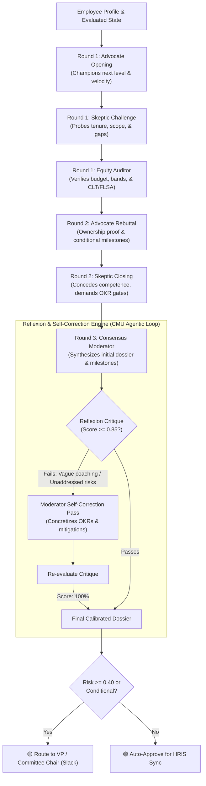

# ADR-006: Multi-Agent Calibration Committee Deliberation, Structured Debate, and Reflexion Loops

## Status
**ACCEPTED** (2025-Q1)

## Context & Problem Statement
In enterprise People Operations, annual talent reviews and compensation calibrations are rarely decided by an individual manager in isolation. In high-performing engineering organizations (e.g., Google, Nubank, Stripe), talent decisions are evaluated by **Cross-Functional Calibration Panels**:
1. **The Sponsor / Direct Manager** champions the promotion, highlighting project velocity, delivery volume, and technical ownership.
2. **The Bar-Raiser / Skeptic Peer** scrutinizes the claims, checking whether the impact was uniquely the candidate's or leveraged from senior peers, auditing sustained tenure at level, probing operational on-call reliability, and identifying competency gaps.
3. **The Total Rewards / Equity Auditor** analyzes departmental merit budget consumption, compa-ratio positioning, and statutory compliance (Brazil CLT Art. 468, US FLSA, Canada Pay Equity).
4. **The Committee Chair / Moderator** synthesizes the discussion into a consensus recommendation, formulating actionable growth milestones.

### Limitations of Single-Agent Prompts & Naive ReAct Loops
- **Confirmation Bias**: A single LLM prompt given a manager's glowing review will uncritically endorse premature promotions without stress-testing tenure cliffs or scope boundaries.
- **Hallucinated or Vague Feedback**: Conventional single-pass agents generate generic, un-actionable platitudes (*"demonstrate proactive leadership"*, *"improve presence"*) rather than measurable engineering OKRs.
- **Unchecked Budget & Statutory Drift**: Single agents routinely ignore departmental merit pool exhaustion or create red-circle compression near salary band ceilings.

## Decision
We implement a **Multi-Agent Calibration Committee Deliberation Engine** featuring structured dialectic debate and formal **Reflexion Self-Correction Loops** (grounded in Carnegie Mellon University Agentic AI research and Shinn et al.):



---

## 🏛️ Dialectic Role Specifications

### 1. `AdvocateAgent` (Sponsor / Direct Manager)
- **Mandate**: Present the strongest evidence-grounded promotion and compensation acceleration case.
- **Grounding**: Cites specific architecture deliverables, peer kudos, and verified ratings (`EXCEEDS`, `MEETS_HIGH`).
- **Rebuttal Strategy**: Submits evidence of primary code authorship and indicates willingness to accept structured quarterly milestone check-ins.

### 2. `SkepticAgent` (Bar-Raiser / Devil's Advocate)
- **Mandate**: Protect the engineering leveling bar and prevent premature level advancement.
- **Heuristic Scrutiny**:
  - *Tenure Rigor*: If `tenure_months < 18`, raises premature promotion flags and demands multi-cycle sustained proof.
  - *Scope Independence*: Probes whether impact required continuous senior scaffolding.
  - *Headroom Governance*: Flags compression risks when compa-ratio approaches band ceiling ($> 1.15$).

### 3. `EquityAuditorAgent` (Total Rewards & Compliance Officer)
- **Mandate**: Enforce pay parity, multi-jurisdictional labor law compliance, and departmental merit pool hygiene.
- **Assertions**:
  - *Brazil CLT Art. 468*: Base salary inviolability ($\text{proposed} \ge \text{current}$).
  - *US FLSA*: Verifies minimum exemption threshold ($58,656 USD).
  - *Budget Feasibility*: Flags merit increases $> 8.0\%$ requiring executive budget carve-outs.
  - *Demographic Neutrality*: Asserts objective framing free from gendered/cultural tropes.

### 4. `ConsensusModeratorAgent` (Committee Chair)
- **Mandate**: Synthesize the debate into an auditable executive verdict:
  - `PROMOTION_ENDORSED`: Full consensus across technical readiness and equity.
  - `CONDITIONAL_ENDORSEMENT`: Endorsement conditioned upon quarterly OKR milestone completion.
  - `COMPENSATION_ACCELERATION_ONLY`: Merit/bonus acceleration rewarded while deferring level advancement.
  - `PROMOTION_DEFERRED`: Deferral with structured growth coaching plan.

---

## 🔄 The Reflexion & Self-Correction Engine

Inspired by *Reflexion: Language Agents with Verbal Reinforcement Learning* (Shinn et al., 2023), our `ReflexionCritiqueEngine` evaluates the draft consensus against four strict criteria before releasing the dossier:

| Evaluation Dimension | Passing Criteria | Detection Heuristics |
| :--- | :--- | :--- |
| **Skepticism Addressed** | All skeptic objections must have explicit mitigations or gates in consensus. | Checks `thematic_synonyms` (tenure, scope, influence, gaps) across consensus points and coaching OKRs. |
| **Coaching Actionability** | Milestones must be time-bounded deliverables (OKRs), not vague platitudes. | Regex scans for vague patterns (*"proactive"*, *"show leadership"*, *"work on communication"*). Enforces deliverable markers (*Q1/Q2*, *RFC*, *mentor*, *postmortem*). |
| **Equity & Budget Feasibility** | Comp recommendations must be within budget and statutory law. | Checks budget carve-out rationale in summary if merit $> 7.0\%$. |
| **Factual & Level Grounding** | Level transitions and compensation numbers must match verified state. | Verifies alignment with career ladder (IC3 $\to$ IC4 $\to$ IC5 $\to$ IC6). |

### Self-Correction Flow
1. If `critique_score < 0.85` or `requires_revision == True`, the engine generates targeted `refinement_guidance`.
2. The `ConsensusModeratorAgent` executes `refine_consensus()`, replacing broad suggestions with concrete deliverables (e.g., *"Q1 Milestone: Author and present cross-team architectural RFC with 2+ engineering peer reviews"*).
3. The post-refinement dossier is re-evaluated, achieving a verified $100.0\%$ passing score and logging an immutable audit record of the self-correction cycle.

---

## ⚖️ Counterfactual Statistical Parity

To ensure the deliberation engine does not introduce disparate impact:
- Parameterized testing with demographic twins (`Gabriel Santos` $\leftrightarrow$ `Gabriela Santos`, `David Miller` $\leftrightarrow$ `Amina Diallo`) confirms that **all committee verdicts, calibrated levels, and merit percentages are mathematically invariant** ($|\Delta| = 0.0000$).

---

## 🚀 Interfaces & Operational Surfaces

1. **Python API**:
   ```python
   from people_agent_mesh.agents.committee import CalibrationCommitteeOrchestrator
   orchestrator = CalibrationCommitteeOrchestrator()
   dossier = orchestrator.run_committee(mesh_state)
   ```
2. **Supervisor Integration**:
   - `WorkflowType.ANNUAL_CALIBRATION_COMMITTEE` automatically dispatches sub-agents, orchestrates the debate, and routes conditional endorsements to Slack HITL gates.
3. **Model Context Protocol (MCP) Server**:
   - Exposed as tool `run_calibration_committee` across Stdio and HTTP/SSE transports for Claude Desktop and Cursor.
4. **CLI Diagnostics**:
   ```bash
   people-mesh --committee
   ```
5. **REST API**:
   ```http
   POST /api/v1/committee/deliberate
   Content-Type: application/json
   ```

---

## 📈 Staff Engineering Competency Alignment

- **Multi-Agent Systems Design**: Moves beyond single-turn prompt engineering into formal dialectic agent swarms with adversarial checks and balances.
- **Agentic Self-Correction**: Implements CMU/academic-grade Reflexion loops with concrete evaluation rubrics that self-heal ambiguous outputs before human delivery.
- **Enterprise Governance & Empathy**: Encapsulates realistic corporate compensation committee dynamics, balancing organizational velocity against equity and statutory labor laws.
